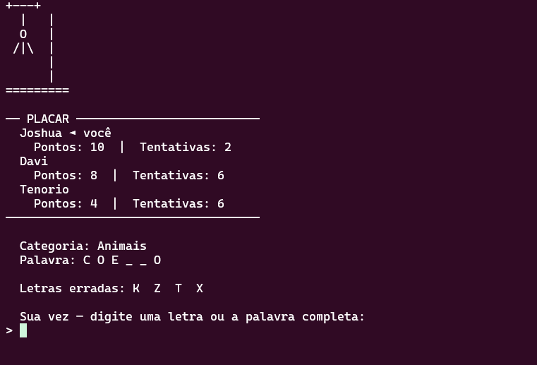

# Jogo da forca competitivo multijogador 

Este é um jogo da Forca competitivo e distribuído, baseado em arquitetura cliente-servidor utilizando **Sockets TCP** nativos em Python. O projeto suporta partidas multijogador em tempo real com gerenciamento de concorrência por threads, atualizações full-duplex de estado e um sistema de campeonato acumulativo entre rodadas.

---

## 📁 Estrutura do projeto

```text
COMPETITIVE-HANGMAN/
│
├── assets/
│   ├── forca.txt         #Arte ASCII com as 7 etapas da forca
│   └── palavras.txt      #Banco de palavras estruturado (palavra, categoria)
│
├── cliente/
│   ├── client.py         #Ponto de entrada do cliente (I/O e conexão TCP)
│   └── local_state.py    #Máquina de estados local do cliente (True Source of Truth)
│
├── interface/
│   └── renderer.py       #Engine gráfica textual (ASCII) para o terminal
│
├── servidor/
│   ├── game_server.py    #Servidor central TCP (Gerenciador de Threads/Conexões)
│   ├── game_state.py     #Estado global do jogo com travas de concorrência (Lock)
│   └── word_manager.py   #Mecanismo de IO do banco de palavras estático
│
└── utils/
    └── protocol.py       #Framing de dados em rede (Mensagens delimitadas por \n)
```

---

## 🏗️ Arquitetura do sistema

O sistema opera sob o modelo de **Threads dedicadas por cliente** com estado centralizado e sincronizado através de travas primitivas (`threading.Lock`), mitigando condições de corrida (race conditions).

```
+-----------------------------------------------------------------------+
|                        SERVIDOR (Porta 5000)                          |
|                                                                       |
|   [Main Thread] ---> escuta conexões via socket.accept()              |
|                           │                                           |
|                           ├──► [Thread Cliente 1] ◄──► Socket TCP ──┐ |
|                           ├──► [Thread Cliente 2] ◄──► Socket TCP ──┼─┐
|                           └──► [Thread Cliente 3] ◄──► Socket TCP ──┼─┼─┐
|                                                                     │ │ │
|   [Game State Global] ◄─── Compartilhado com Thread Lock (Sinc)     │ │ │
+---------------------------------------------------------------------+─┼─┼─+
                                                                      │ │ │
                                     ┌────────────────────────────────┘ │ │
                                     │ ┌────────────────────────────────┘ │
                                     │ │ ┌────────────────────────────────┘
                                     ▼ ▼ ▼
+-------------------------------------------------------------------------+
|                             APLICAÇÃO CLIENTE                           |
|                                                                         |
|  [Thread Principal] ──► Lê input do teclado (User I/O) ──► Envia TCP    |
|  [Thread Recv Loop] ◄── Escuta Socket (Bloqueante) ◄─── Atualiza Estado  |
|                                │                                        |
|                                └──► Invoca Renderer (Redesenha a Tela)  |
+-------------------------------------------------------------------------+
```

---

## 🔌 Protocolo de mensagens (JSON Framed)

As mensagens trafegam pela rede codificadas em **UTF-8** no formato **JSON**, estritamente finalizadas pelo caractere delimitador `\n` (newline), o que viabiliza o correto empacotamento/desempacotamento na camada de transporte mesmo diante de fragmentação TCP.

| Tipo de Mensagem | Direção | Campos do Payload | Descrição / Momento do Envio |
|---|---|---|---|
| `JOIN` | Cli → Serv | `string` (Nome do jogador) | Enviada imediatamente após o handshake TCP bem-sucedido. |
| `WELCOME` | Serv → Cli | `{"your_id": int}` | Atribui o ID exclusivo gerado pelo servidor ao respectivo cliente. |
| `WAITING` | Serv → Cli | `{"connected": int, "needed": int}` | Broadcast enviado sempre que a contagem da sala muda no lobby de espera. |
| `GAME_START` | Serv → Cli | `{"category": str, "word_length": int}` | Notifica o início de um novo round informando dados iniciais da palavra. |
| `STATE_UPDATE` | Serv → Cli | `{"phase": str, "revealed": str, "all_players": list[dict]}` | Broadcast contendo o estado completo atual da partida para renderização. |
| `GUESS_LETTER` | Cli → Serv | `string` (Uma única letra) | Palpites de letra única enviados durante o turno ativo do jogador. |
| `GUESS_WORD` | Cli → Serv | `string` (Palavra completa) | Tentativa de chute direto da palavra inteira. |
| `CORRECT_GUESS` | Serv → Cli | `{"player_id": int, "guess": str, "positions": list[int]}` | Broadcast avisando que um palpite foi correto e quais posições revelou. |
| `WRONG_GUESS` | Serv → Cli | `{"player_id": int, "guess": str}` | Broadcast que desconta uma vida do jogador autor do palpite incorreto. |
| `PLAYER_OUT` | Serv → Cli | `{"player_id": int}` | Broadcast enviado quando um jogador zera suas vidas ou se desconecta. |
| `GAME_OVER` | Serv → Cli | `{"winner_name": str, "word": str, "scores": list[dict]}` | Finaliza o round exibindo estatísticas completas e o vencedor. |
| `ERROR` | Serv → Cli | `{"message": str}` | Mensagem de controle (Ex: Servidor lotado - limite de 3 conexões). |

---

## 🕹️ Dinâmica do jogo e regras do campeonato

### Regras gerais e fluxo

- O jogo suporta até **3 jogadores simultâneos**, necessitando de no mínimo **2 jogadores** para iniciar a partida.
- Cada jogador inicia a rodada com **6 tentativas (vidas)**.
- Chutes incorretos reduzem 1 tentativa do jogador que efetuou o palpite. Ao zerar suas tentativas, o jogador é eliminado do round atual e entra automaticamente em modo **[ESPECTADOR]**, podendo acompanhar os palpites alheios em tempo real mas impossibilitado de enviar novos comandos.

### Sistema de pontuação dinâmico

- **Por letra:** Acertar uma letra concede ao jogador **+1 ponto** para cada posição em que a letra aparece na palavra.
- **Por palavra:** Chutar a palavra completa de forma correta concede ao jogador os pontos correspondentes a todas as letras únicas válidas contidas na palavra.

### Critério de desempate

A classificação do placar final é estritamente ordenada pelos seguintes critérios sucessivos (decrescentes):

1. **Pontuação total** (`score`): Maior número acumulado de pontos.
2. **Letras únicas corretas** (`unique_letters`): Quantidade total de caracteres alfabéticos distintos acertados pelo jogador ao longo das rodadas.

### Condições de reset total do jogo

Para permitir partidas consecutivas em formato de campeonato (onde os pontos acumulam rodada a rodada), o estado do servidor só executará o `reset()` completo (zerando o placar global) nas seguintes situações:

- Restar apenas **1 ou nenhum** jogador conectado nos sockets TCP (Vitória por W.O.).
- Todas as palavras cadastradas em `assets/palavras.txt` forem esgotadas.
- Todos os jogadores conectados ficarem sem vidas simultaneamente no mesmo round.

---

## 🖥️ Demonstração da interface (Screenshot ASCII)

Abaixo está a representação exata da visualização de um cliente no terminal durante uma partida ativa:



---

## 🚀 Como rodar o jogo 

Certifique-se de possuir o **Python 3.8 ou superior** instalado em sua máquina. Não são necessárias dependências externas (o projeto utiliza bibliotecas nativas da linguagem).

### No Linux / macOS 🐧 🍏

1. Abra um Terminal e navegue até a raiz do projeto.
2. Inicie o Servidor:

```bash
python3 servidor/game_server.py
```

3. Abra novos terminais (um para cada jogador, máximo de 3) e execute o cliente:

```bash
python3 cliente/client.py
```

### No Windows 🪟

1. Abra o Prompt de Comando (CMD) ou PowerShell na raiz do projeto.
2. Inicie o Servidor:

```dos
python servidor/game_server.py
```

3. Abra novos prompts de comando e execute o cliente para simular os jogadores:

```dos
python cliente/client.py
```

### Rodar o jogo via LAN (LOCAL AREA NETWORK) 🛜

Para jogar em uma rede local, siga os passos abaixo:

1. Todos os computadores devem estar na mesma rede Wi-Fi/cabeada.
2. Na máquina que será o servidor, descubra o IP local:

```bash
# Linux / macOS
hostname -I
```

```dos
:: Windows
ipconfig
```

Procure um endereço parecido com `192.168.x.x` ou `10.x.x.x`.

3. Inicie o servidor escutando na rede:

```bash
python3 servidor/game_server.py --host 0.0.0.0 --port 5000
```

No Windows:

```dos
python servidor/game_server.py --host 0.0.0.0 --port 5000
```

4. Em cada computador cliente, execute apontando para o IP da máquina servidora:

```bash
python3 cliente/client.py 192.168.1.10 --port 5000
```

No Windows:

```dos
python cliente/client.py 192.168.1.10 --port 5000
```

Substitua `192.168.1.10` pelo IP local real do servidor.

5. Se os clientes não conectarem, verifique:

- O firewall da máquina servidora precisa liberar a porta TCP `5000`.
- O servidor deve continuar aberto enquanto os clientes jogam.
- Se o servidor estiver rodando dentro do WSL, talvez a LAN não consiga acessar diretamente o IP do Linux virtualizado. Nesse caso, prefira rodar o servidor no Python do Windows ou configure encaminhamento de porta do Windows para o WSL.
- Todos os jogadores devem usar a mesma porta configurada no servidor.

---

## 👥 Equipe 

Larissa Ferreira 
Otávio Menezes
Davi Celestino
João Victor
Renato Coca
---
